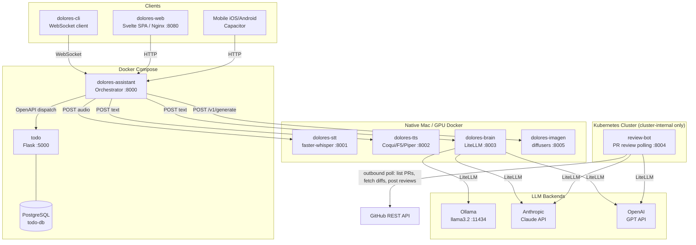
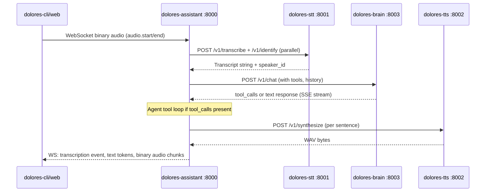

# System Architecture

**Project**: python-apps (Dolores Monorepo)
**Architecture Pattern**: Orchestrated Microservices + Hybrid Native/Docker Deployment
**Last Updated**: 2026-03-24

## High-Level Architecture

## Architectural Patterns

### Orchestrated Microservices
Five independent FastAPI services — `dolores-assistant` (:8000), `dolores-stt` (:8001), `dolores-tts` (:8002), `dolores-brain` (:8003), `dolores-web` (:8080) — each with its own Dockerfile and `pyproject.toml`. The assistant is the single entry-point WebSocket gateway that fans requests out to specialized AI services.

### Hybrid Native/Docker Deployment
`docker-compose.yml` intentionally points `DOLORES_STT_URL`, `DOLORES_TTS_URL`, and `DOLORES_BRAIN_URL` at `host.docker.internal`, so ML-heavy services run natively on Mac (Apple Silicon Metal/MLX) while the orchestrator and frontend run containerised. Separate `Dockerfile.gpu` images exist for NVIDIA GPU workloads.

### Dynamic Tool Integration
The assistant accepts a `DOLORES_INTEGRATIONS` JSON env var listing external services with their OpenAPI spec paths. `dolores-assistant` fetches specs at startup and generates Tool instances per operation — no code changes required to add new integrations.

### Dual GPU Strategy
Every ML service has a slim `Dockerfile` and a `Dockerfile.gpu` (built on `docker/Dockerfile.gpu-base` from `nvidia/cuda:12.4.1`). Makefile targets: `gpu-base`, `gpu-build`, `gpu-build-all`.

### Shared Library
`libs/dolores-common` (FastAPI, Pydantic, structlog, auth, health, middleware) is installed as an editable package in every Dolores service Dockerfile before the service itself.

### Multi-Provider LLM Abstraction
`dolores-brain` uses LiteLLM (>=1.63.2). `BrainConfig` exposes `default_provider` (ollama), `anthropic_api_key`, `openai_api_key`. Provider and model are selectable per-request.

---

## Layered Architecture

| Layer | Purpose | Components |
|-------|---------|------------|
| **Client Layer** | User-facing interfaces for text and voice interaction | `apps/dolores-cli`, `apps/dolores-web` |
| **Orchestration Layer** | Pipeline coordination, intent classification, WebSocket gateway, dynamic tool dispatch | `apps/dolores-assistant` |
| **AI Services Layer** | Speech recognition, LLM inference, speech synthesis | `apps/dolores-stt`, `apps/dolores-brain`, `apps/dolores-tts` |
| **Integration Layer** | External tool services registered via OpenAPI spec discovery | `apps/todo` |
| **Infrastructure Layer** | Shared library, databases, local LLM server | `libs/dolores-common`, SQLite, PostgreSQL, Ollama |

---

## Data Flows

### Voice Conversation Pipeline

### Dynamic Tool Dispatch
1. Assistant reads `DOLORES_INTEGRATIONS` JSON env var at startup
2. Fetches OpenAPI spec from each integration's `spec_path` endpoint
3. On intent match, dispatches HTTP request to registered tool URL with user JWT
4. Returns tool response as part of assistant reply

### LLM Routing
1. Brain receives text + optional provider override
2. Prepends conversation history window (default 20 msgs) from SQLite
3. LiteLLM routes to Ollama (local default), Anthropic, or OpenAI
4. Response + updated history written back to SQLite

---

## Service Ports

| Service | Port | Type |
|---------|------|------|
| dolores-assistant | 8000 | FastAPI (WebSocket + REST) |
| dolores-stt | 8001 | FastAPI (REST + WebSocket) |
| dolores-tts | 8002 | FastAPI (REST) |
| dolores-brain | 8003 | FastAPI (REST + SSE) |
| review-bot | 8004 | FastAPI (REST) — cluster-internal only |
| dolores-imagen | 8005 | FastAPI (REST) |
| todo | 5000 | Flask (REST + Web UI) |
| dolores-web | 8080 | Nginx serving Svelte SPA |
| ollama | 11434 | LLM inference |
| todo-db | 5432 | PostgreSQL |

---

## Security Architecture

### Authentication Layers
| Layer | Mechanism | Env Var |
|-------|-----------|---------|
| Inter-service | PSK bearer token | `DOLORES_SERVICE_PSK` |
| Client-to-assistant | API key bearer | `DOLORES_API_KEY` |
| User data access | OIDC JWT passthrough | forwarded as `user_token` |
| Todo web session | OIDC Authorization Code + PKCE | `OIDC_ISSUER`, `OIDC_CLIENT_ID/SECRET` |

Dev mode bypasses validation when env vars are unset.

### JWT Passthrough Flow
OIDC access token flows from browser → WebSocket `session.start` → `current_user_token` ContextVar → `OpenAPITool.execute()` → Bearer header on downstream HTTP calls, enabling per-user data isolation in integration services.

---

## Integrations

| Service | Purpose | Integration Type |
|---------|---------|----------------|
| Ollama | Local LLM inference (llama3.2) | HTTP REST via LiteLLM |
| Anthropic Claude | Cloud LLM fallback | LiteLLM abstraction |
| OpenAI | Cloud LLM fallback | LiteLLM abstraction |
| GitHub REST API | review-bot polls for open PRs, fetches diffs and AGENTS.md, posts reviews — outbound from cluster, no inbound webhook | Outbound HTTP polling (review-bot) |
| GitHub Actions + GHCR | CI: test, build, push Docker images | Workflow automation |
| Capacitor | iOS/Android wrapper for dolores-web | Mobile native bridge |
| Authentik | OIDC provider for todo app (optional) | OAuth2/OIDC |
| FLUX / diffusers (HuggingFace) | Local image generation via dolores-imagen; supports FLUX.1-schnell and Stable Diffusion on Apple MPS and NVIDIA CUDA | Local Python library (dolores-imagen) |

---

## Deployment

### Environments
- **Mac native**: STT (:8001), TTS (:8002), Brain (:8003) — native Python for Metal/MLX acceleration
- **Docker**: dolores-assistant (:8000), dolores-web (:8080), todo (:5000), todo-db — containerised
- **GPU Docker**: NVIDIA `Dockerfile.gpu` images for CUDA workloads

### CI/CD Strategy
- Tag push `<app>-vX.Y.Z` → builds only that single app image
- Branch push → builds all apps with Dockerfiles
- Images published to `ghcr.io/<owner>/<app>:latest | :<sha> | :<semver>`

### State Storage
| Service | Storage |
|---------|---------|
| dolores-brain | `data/conversations.db` (SQLite) |
| dolores-stt | `data/speakers.db` (SQLite) |
| dolores-tts | `data/tts.db` + `data/voices/` (SQLite + filesystem) |
| todo (dev) | `data/appdata.json` (JSON file) |
| todo (prod) | PostgreSQL `todo-db` |

---

## Performance Considerations

### GPU Concurrency
`asyncio.Semaphore(1)` per GPU service (STT, TTS) serializes concurrent requests without rejecting them — prevents OOM under simultaneous user load.

### Graceful Degradation
`ServiceClient` returns `None` on HTTP failures. Pipeline continues without STT (text-only fallback) or TTS. Errors surfaced as assistant text rather than hard failures.

### Sentence-Level TTS Streaming
Brain response text split at sentence boundaries; each sentence synthesized independently so audio playback begins before full response is complete.
