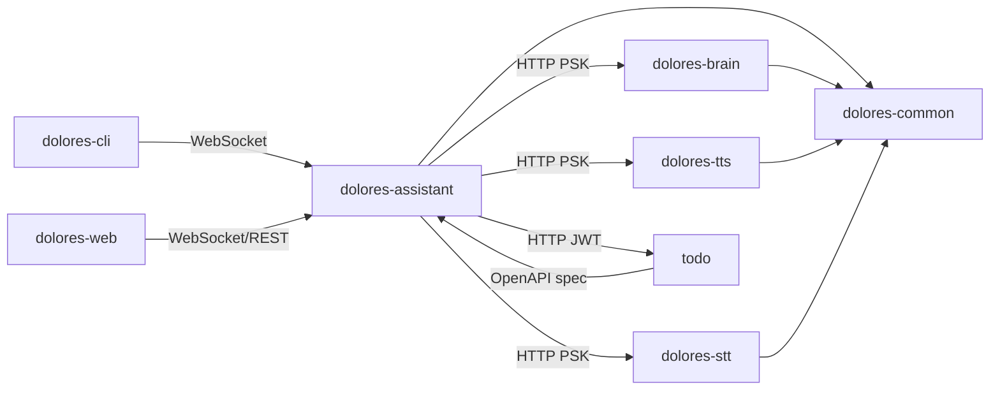

# Modules & Components

**Project**: python-apps (Dolores Monorepo)
**Last Updated**: 2026-03-24

## Module Overview

| Module | Type | Files | Purpose |
|--------|------|-------|---------|
| `apps/dolores-assistant` | FastAPI service | 6 | Orchestrator: WebSocket gateway, STT→Brain→TTS pipeline, agent tool loop |
| `apps/dolores-assistant/tools` | Sub-module | 3 | Dynamic tool system via OpenAPI spec discovery |
| `apps/dolores-brain` | FastAPI service | 3 | LLM inference: conversation history, LiteLLM routing, streaming |
| `apps/dolores-tts` | FastAPI service | 5 | TTS synthesis with pluggable engine backends, voice profile CRUD |
| `apps/dolores-tts/engines` | Sub-module | 3 | Concrete TTS engines: CoquiXTTS, F5-TTS MLX, Piper |
| `apps/dolores-stt` | FastAPI service | 2 | Audio transcription, speaker ID, speaker profile management |
| `apps/dolores-cli` | CLI app | 4 | Terminal voice/text chat client over WebSocket |
| `apps/dolores-web` | Svelte SPA | 9 | Browser frontend: chat, avatar, voice, OIDC auth |
| `apps/todo` | Flask service | 7 | Todo/notes/work-log REST API with dual storage backends |
| `libs/dolores-common` | Shared library | 5 | Auth, health, logging, middleware, error utilities |

---

## Core Service Modules

### `apps/dolores-assistant`
**Purpose**: Central orchestrator — receives client input over WebSocket, runs STT/speaker-ID in parallel, routes to Brain (with agent tool loop), synthesizes TTS per sentence, streams audio back.

**Key Components**:

| Component | File | Responsibility |
|-----------|------|---------------|
| `ServiceClient` | `pipeline.py` | HTTP client facade for all downstream service calls; GPU semaphore control; PSK injection |
| `run_tool_loop` | `pipeline.py` | Agent loop: detect tool_calls → execute → send results → iterate until text response |
| `IntentClassifier` | `intent.py` | ONNX all-MiniLM-L6-v2 classifier; lazy-loaded; centroid cosine similarity; returns tool_filter |
| `AssistantRoutes` | `routes.py` | FastAPI router: POST /v1/chat + WS /v1/conversation; session lifecycle management |

**Public API**:
- `WS /v1/conversation` — session protocol: `session.start`, `audio.start/end`, `text.send`, `session.end`
- `POST /v1/chat` — text-only REST endpoint
- `GET/POST/DELETE /v1/voices/{id}` — voice profile proxy
- `GET/POST/DELETE /v1/speakers/{id}` — speaker management proxy

**Auth**: Clients authenticate with `DOLORES_API_KEY`; user OIDC token forwarded as `user_token` in `session.start`

---

### `apps/dolores-assistant/tools`
**Purpose**: Dynamic tool system — discovers tools from OpenAPI specs of integration services at startup, exposes them to the LLM agent loop.

| Component | File | Responsibility |
|-----------|------|---------------|
| `Tool` (ABC) | `base.py` | Abstract base: name, description, JSON Schema params, async `execute()` |
| `OpenAPITool` | `openapi_discovery.py` | Dynamically generated Tool from OpenAPI operation; forwards user JWT via ContextVar |
| `discover_tools` | `openapi_discovery.py` | Fetch `/openapi.json` from integrations at startup; generate Tool instances prefixed by integration name |
| `ToolRegistry` | `registry.py` | In-memory TOOLS list; name-filter lookup for intent-based routing |

---

### `apps/dolores-brain`
**Purpose**: LLM inference — conversation history in SQLite, multi-provider routing via LiteLLM, streaming chat endpoints.

| Component | File | Responsibility |
|-----------|------|---------------|
| `ConversationStore` | `conversation.py` | Async SQLite (aiosqlite): create/append/list conversations and messages |
| `BrainRoutes` | `routes.py` | POST /v1/chat + SSE /v1/chat/stream; history windowing; tool_calls passthrough |
| `ProviderConfig` | `provider_config.py` | Configure LiteLLM env vars; resolve provider+model to LiteLLM model strings |

**Public API**: `POST /v1/chat`, `POST /v1/chat/stream` (SSE), `GET /v1/providers`
**Auth**: Requires `DOLORES_SERVICE_PSK`

---

### `apps/dolores-tts`
**Purpose**: Text-to-speech — pluggable engine backends, voice profile CRUD with reference audio on filesystem and metadata in SQLite.

| Component | File | Responsibility |
|-----------|------|---------------|
| `TTSEngine` (ABC) | `engine.py` | Interface: `name`, `is_loaded`, `load()`, `synthesize()`, `list_voices()` |
| `CoquiXTTSEngine` | `engines/coqui_xtts.py` | XTTS v2 voice cloning; CUDA/CPU auto-select (avoids MPS on Mac) |
| `F5TTSEngine` | `engines/f5_tts.py` | F5-TTS MLX for Apple Silicon; requires reference audio + text |
| `PiperEngine` | `engines/piper.py` | CPU fallback stub |
| `VoiceProfileStore` | `voice_profiles.py` | Async SQLite: create/list/get/delete profiles; WAV saved to disk |
| `TTSRoutes` | `routes.py` | POST /v1/synthesize; ffmpeg audio conversion; voice CRUD |

**Public API**: `POST /v1/synthesize`, `GET/POST/DELETE /v1/voices/{id}`
**Auth**: Requires `DOLORES_SERVICE_PSK`

---

### `apps/dolores-stt`
**Purpose**: Speech-to-text — audio transcription via faster-whisper, speaker identification via voice embeddings.

| Component | File | Responsibility |
|-----------|------|---------------|
| `STTRoutes` | `routes.py` | POST /v1/transcribe; POST /v1/identify; speaker CRUD; WS /v1/stream |
| `SpeakerStore` | `speaker_store.py` | SQLite + sync sqlite3 + asyncio.to_thread; running-average embedding updates |

**Public API**: `POST /v1/transcribe`, `POST /v1/identify`, `GET/POST/DELETE /v1/speakers`, `WS /v1/stream`
**Auth**: Requires `DOLORES_SERVICE_PSK`

---

### `apps/dolores-cli`
**Purpose**: Terminal client — text and voice chat over WebSocket to dolores-assistant, push-to-talk microphone recording, WAV playback.

| Component | File | Responsibility |
|-----------|------|---------------|
| `DoloresClient` | `client.py` | WebSocket client: session management, text/audio message exchange |
| `VoiceChat` | `voice_chat.py` | Push-to-talk voice chat loop |
| `Chat` | `chat.py` | Text-only chat loop |
| `AudioRecorder` | `audio.py` | sounddevice mic recording; ffmpeg conversion to WebM/Opus; WAV playback |

---

### `apps/dolores-web`
**Purpose**: Svelte 5 SPA — chat and avatar views, voice recording, streaming text, TTS audio playback, OIDC auth, emotion-driven avatar.

| Component | File | Responsibility |
|-----------|------|---------------|
| `DoloresClient` | `lib/DoloresClient.ts` | Browser WebSocket client; typed message protocol; audio chunk streaming |
| `AppStore` | `lib/stores.svelte.ts` | Svelte 5 `$state` singleton: orchestrates client, audio, OIDC, UI state |
| `OIDCAuth` | `lib/auth.ts` | Minimal OIDC PKCE flow: login, callback, token refresh, logout |
| `AudioRecorder` | `lib/AudioRecorder.ts` | MediaRecorder wrapper; format negotiation for cross-browser + iOS |
| `AudioPlayer` | `lib/AudioPlayer.ts` | Queued WAV playback via Web Audio API; volume analysis for lip sync |
| `ChatView` | `lib/components/ChatView.svelte` | Streaming chat message display |
| `AvatarView` | `lib/components/AvatarView.svelte` | Avatar rendering with phase/emotion transitions |
| `VoiceButton` | `lib/components/VoiceButton.svelte` | Push-to-talk UI control |

**AppStore responsibilities** (central state machine):
- Stop TTS playback when recording starts (feedback prevention)
- Buffer early tokens to detect/strip emotion tags before display
- Silently refresh OIDC token on `session_expired` events

---

### `apps/todo`
**Purpose**: Flask REST API for todos, notes, work items; dual storage backends; consumed by Dolores assistant via OpenAPI auto-discovery.

| Component | File | Responsibility |
|-----------|------|---------------|
| `TodoAPI` | `api.py` | CRUD endpoints; dual auth (bearer JWT + session cookie); cross-provider OIDC identity reconciliation |
| `JsonStore` | `storage.py` | JSON file + atomic writes + rotating backups + WAL crash recovery |
| `PostgresStore` | `db_store.py` | SQLAlchemy ORM; multiuser isolation by `user_id`; get-or-create user from OIDC claims |
| `JWTAuth` | `jwt_auth.py` | Bearer token validation for mobile/API clients |
| `WebUI` | `web.py` | Browser session-based web interface |

**Public API**: `GET /api/openapi.json`, `CRUD /api/todos`, `CRUD /api/notes`, `CRUD /api/work`, web UI at `/`

---

### `libs/dolores-common`
**Purpose**: Shared library for all Dolores FastAPI services — auth, health, logging, middleware, error utilities.

| Component | File | Responsibility |
|-----------|------|---------------|
| `auth` | `auth.py` | `ServicePSK`, `ClientAPIKey` FastAPI dependencies; `validate_ws_token` |
| `health` | `health.py` | Factory for `/health` and `/livez` routers with uptime tracking |
| `logging` | `logging.py` | structlog setup with service-name context; `get_logger()` factory |
| `middleware` | `middleware.py` | CORS + request-ID middleware; propagate or generate `x-request-id` |
| `errors` | `errors.py` | Standard `ErrorResponse`, `service_unavailable_handler` |

**Contracts**: `DOLORES_SERVICE_PSK` for inter-service auth, `DOLORES_API_KEY` for client auth

---

## Dependency Graph

---

## External Dependencies

| Library | Version | Used By | Purpose |
|---------|---------|---------|---------|
| litellm | >=1.63.2 | dolores-brain | LLM provider abstraction |
| TTS (coqui) | >=0.22 | dolores-tts | XTTS v2 voice cloning |
| f5-tts-mlx | latest | dolores-tts | Apple Silicon TTS |
| onnxruntime | >=1.16 | dolores-assistant | Intent classification inference |
| structlog | >=23.0 | dolores-common | Structured logging |
| fastapi | >=0.100 | all Dolores services | Web framework |
| flask | >=3.0 | todo | Web framework |
| sqlalchemy | >=2.0 | todo | PostgreSQL ORM |
| aiosqlite | >=0.19 | dolores-brain, dolores-tts | Async SQLite |
| httpx | >=0.25 | dolores-assistant | Async inter-service HTTP client |
| websockets | >=12.0 | dolores-cli | WebSocket client |
| resemblyzer | >=0.1.3 | dolores-stt | Speaker voice embeddings |
| PyJWT | >=2.0 | todo | JWT validation |
| authlib | >=1.0 | todo | OIDC/OAuth2 client |
| sounddevice/soundfile | latest | dolores-cli | Microphone recording + playback |

---

## Module Metrics

| Module | Files | ~LoC | Components | Ext Dependencies |
|--------|-------|------|------------|-----------------|
| dolores-assistant | 6 | 1150 | 5 | 3 |
| dolores-brain | 3 | 520 | 3 | 3 |
| dolores-tts | 5 | 650 | 5 | 3 |
| dolores-stt | 2 | 430 | 2 | 2 |
| dolores-cli | 4 | 330 | 4 | 3 |
| dolores-web | 9 | 1050 | 7 | 3 |
| todo | 7 | 1400 | 6 | 4 |
| dolores-common | 5 | 210 | 5 | 2 |

---

## Cross-Module Patterns

| Pattern | Modules Involved | Benefit |
|---------|-----------------|---------|
| Pipeline Orchestration | assistant, brain, tts, stt | Each service independently deployable; GPU-heavy services isolated |
| PSK Inter-Service Auth + JWT Passthrough | all services, todo, common | Clean separation of service auth from user auth |
| OpenAPI-Driven Tool Discovery | assistant/tools, todo | Adding integrations requires only an OpenAPI spec |
| Pluggable Engine Strategy | dolores-tts, dolores-stt | Hardware-specific engines cleanly isolated; fallback substitution |
| Dual Storage Backend | todo | Dev uses JSON; prod uses PostgreSQL; zero API changes |
| Shared Common Library | common, all FastAPI services | Single point of change for auth or logging |
